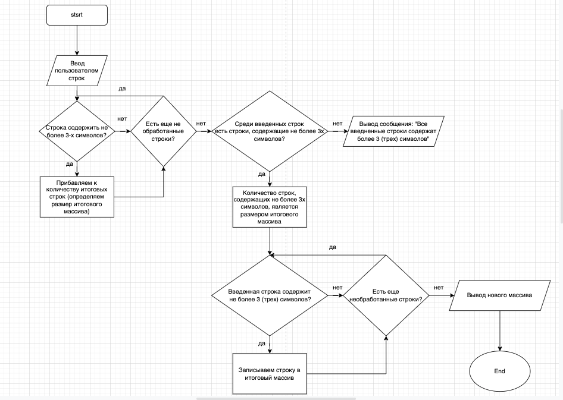

#  Задача.
Написать программу, которая из имеющегося массива строк формирует новый массив из строк, длина которых меньше, либо равна 3 символам. Первоначальный массив можно ввести с клавиатуры, либо задать на старте выполнения алгоритма. При решении не рекомендуется пользоваться коллекциями, лучше обойтись исключительно массивами.

# Блок-схема алгоритма.

# Описание алгоритма решения задачи.
**1.** Пользователь вводит количество строк, которые планирует ввести.

**2.** Пользователь вводит строки поочерёдно.

**3**. Определяем количество строк, содержащих не более 3 (трёх) элементов (так определяем размер итогового массива).

**4**. Если в п.3 определено, что искомых строк не введено, выводим сообщение: "Все введённые строки содержат более 3 (трёх) символов.".

**5**. Если в п.3 определено, что среди введённых строк есть искомые строки, записываем эти строки в итоговый массив.

**6**. Выводим итоговый массив на печать.

# Код решения задачи.
Код решения задачи расположен в папке task файл Program.cs.